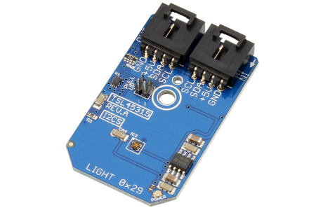

# TSL45315
TSL45315 Ambient Light Sensor 

The TSL45315 device, provides ambient light sensing (ALS), giving direct lux output.
This Sample code can be used with Raspberry pi.

#Java 
Download and install pi4j library on Raspberry pi.
Steps to install pi4j are provided at:
http://pi4j.com/install.html

Download (or git pull) the code in pi.
Compile the java program. 
$ >pi4j  TSL45315.java

Run the java program as.
$ >pi4j  TSL45315

#Python 
Download and install smbus library on Raspberry pi.
Steps to install smbus are provided at:
https://pypi.python.org/pypi/smbus-cffi/0.5.1

Download (or git pull) the code in pi.
Run the program.
$ >python TSL45315.py

The code output is the lux value of ambient light.

